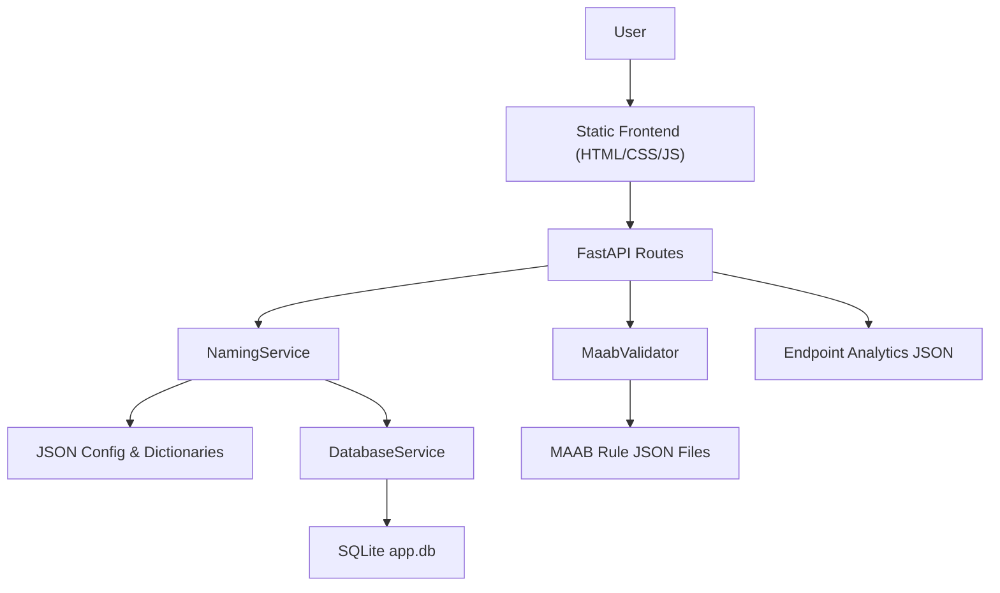

# Variable Naming Service: Full Project Showcase

## 1. Executive Summary

This project is a domain-focused engineering tool that solves a real productivity and quality problem in embedded and automotive software development: generating consistent, standards-aligned variable names from human-readable descriptions.

The system combines:

- a FastAPI backend,
- a browser-based frontend,
- configurable naming-convention JSON packs,
- an AUTOSAR-oriented abbreviation dictionary,
- MAAB naming validation rules,
- SQLite persistence for generated names and abbreviation usage,
- lightweight endpoint analytics,
- and admin-editable convention files.

From a business demonstration perspective, the tool shows more than "name generation". It demonstrates:

- reduction of manual naming effort,
- standardization across teams,
- conflict awareness and reuse intelligence,
- support for compliance workflows,
- persistence and auditability,
- rule-driven extensibility,
- and a path toward enterprise-scale governance.

From a personal skills perspective, the repository showcases:

- backend API design,
- service-layer modularity,
- UI workflow design,
- rule-engine thinking,
- database migration and persistence design,
- analytics-minded engineering,
- standards/compliance integration,
- and practical iteration over multiple releases.

## 2. What the Tool Does

### Core business workflow

1. A user selects variable metadata such as `data_type`, `data_size`, `module`, and `unit`.
2. The user enters a natural-language description.
3. The system tokenizes that description and proposes multiple abbreviation candidates per word.
4. The user selects the most appropriate abbreviation for each token.
5. The tool composes a final variable name using a configurable naming template.
6. The result is checked for duplicate usage, naming-length constraints, and abbreviation conflicts.
7. Accepted names and selected abbreviations are stored in SQLite for future reuse and traceability.

### Extended business workflows

- MAAB validation for MATLAB/Simulink-oriented naming rules.
- Admin editing of naming convention dictionaries without code changes.
- Endpoint analytics to demonstrate adoption and usage.

## 3. Current Architecture

### Architectural characteristics

- Thin route layer: HTTP endpoints mainly delegate to services.
- Service-centric logic: naming, analytics, conflict checks, and raw config editing live in service classes.
- Data-driven behavior: naming rules and options are stored in JSON rather than hardcoded.
- Hybrid persistence model: configuration is file-based, runtime records are database-backed.
- Static frontend delivery: no frontend build pipeline needed, which keeps deployment simple.

## 4. How the Current Product Works

### 4.1 App startup

`app/main.py` initializes the FastAPI app, sets CORS, mounts static files, serves the main pages, and runs `init_db()` during lifespan startup. This is a clean modern FastAPI pattern that ensures the database schema exists before traffic begins.

### 4.2 Naming flow

`app/api/routes.py` exposes:

- `GET /fields`
- `POST /generate-options`
- `POST /generate-variable-name`
- `GET /stats`
- `GET /fields/{field}/raw`
- `PUT /fields/{field}/raw`

These routes call `NamingService`, which:

- loads naming-convention JSON,
- loads abbreviation dictionaries,
- generates option sets,
- builds the final variable name from a template,
- records usage analytics,
- persists generated outputs into SQLite,
- and updates raw field dictionaries.

### 4.3 Abbreviation intelligence

`NamingService.get_options_for_description()` removes stopwords and generates multiple options for each token:

- full word,
- dictionary abbreviation from `data/standards/autosar/abbreviation.json`,
- regex-style compact abbreviation,
- extended fallback abbreviation.

It also checks the database for:

- `in_use`: the same word already used that abbreviation,
- `conflict`: another word already uses the same abbreviation.

This is valuable because it makes naming generation explainable rather than opaque.

### 4.4 Variable name composition

The current ABS template in `data/naming_conventions/abs/format.json` is:

`{data_type}{data_size}{module}_{unit}_{description}`

This means the product supports structured naming made from reusable parts rather than ad hoc string concatenation.

### 4.5 MAAB validation

`MaabValidator` loads component-specific rule files from `data/maab/rules/*.json` and evaluates:

- regex-based rules,
- function-based rules like max-length or reserved keyword checks.

This extends the tool from "generator" into "governance and validation platform".

### 4.6 Persistence

SQLite stores:

- generated variable names in `variable_names`,
- selected word-abbreviation pairs in `abbreviations`.

Current observed database contents:

- `variable_names`: 3 rows
- `abbreviations`: 7 rows

This proves the current system already supports a historical memory of naming decisions.

### 4.7 Analytics

Endpoint usage counts are stored in `data/endpoint_counts.json`. This is simple but effective for a demo because it proves user interaction and adoption patterns without requiring external observability tooling.

## 5. Design Strengths to Showcase

### Scalability

- Configuration scales through JSON packs instead of code rewrites.
- New modules, units, data types, and standards can be added as data.
- Service-based separation makes it practical to swap SQLite for a larger relational database later.
- The current two-step generation flow is API-friendly and can support future UIs, Excel add-ins, or IDE integrations.

### Modularity

- `routes.py` handles HTTP only.
- `naming_service.py` owns naming logic.
- `database_service.py` owns persistence operations.
- `maab_validator.py` owns rule validation.
- static frontend files are isolated from backend code.
- rules and dictionaries are externalized into data files.
### Edge-case handling

- missing description is rejected,
- stopwords are filtered,
- duplicate abbreviations are marked,
- conflicting abbreviations are flagged,
- duplicate final variable names trigger warnings,
- overlength variable names trigger warnings,
- admin payloads are validated before saving,
- JSON file reads use safe loading helpers.

### Extensibility

- naming format is template-driven,
- standards are dictionary-driven,
- MAAB rules are file-driven,
- admin endpoints allow convention updates without redeploying code changes.

### Demonstration value

This is not just a prototype. It shows:

- domain modeling,
- user-centric interaction design,
- maintainable code organization,
- operational awareness,
- and a credible path from internal utility to governed engineering platform.

## 6. File-by-File Repository Walkthrough

This section covers the current project files that define the product or support its demo. The `venv/` directory is intentionally excluded from the business walkthrough because it is an environment artifact, not product logic.

### 6.1 Root files

| File | Role | Demo value |
| --- | --- | --- |
| `.gitignore` | Excludes virtualenv, caches, DB/log artifacts | Shows clean repository hygiene |
| `requirements.txt` | Python dependency list | Shows stack selection and deployment needs |
| `fastapi.service` | Systemd deployment file for Linux hosting | Demonstrates production-minded deployment |
| `fastapi.log` | Runtime access/application log snapshot | Shows the app has been run and observed |
| `fastapi_error.log` | Error log snapshot | Shows debugging and operational iteration |
| `varNameGen.xlsm` | Excel macro workbook | Shows intent for end-user integration beyond web |
| `log.md` | Local analysis note, currently untracked | Evidence of iterative engineering documentation |
| `PROJECT_SHOWCASE.md` | This full showcase document | Demo-ready narrative artifact |

### 6.2 Backend application files

| File | Role | Why it matters |
| --- | --- | --- |
| `app/main.py` | FastAPI app entry point, startup lifecycle, static page serving | Core application bootstrapping |
| `app/api/routes.py` | All active API endpoints | Main contract between UI and backend |
| `app/core/database.py` | SQLite connection and schema creation | Persistence foundation |
| `app/core/test.py` | DB inspection helper | Demonstrates validation/debug workflow |
| `app/services/naming_service.py` | Main naming engine | The heart of the business logic |
| `app/services/database_service.py` | Database insert/query helpers | Separation of persistence responsibilities |
| `app/services/maab_validator.py` | Rule-driven MAAB validation engine | Compliance/governance capability |
| `app/services/llm_abbreviator.py` | Experimental local/paid LLM abbreviation generation code | Shows AI-assisted exploration and fallback thinking |
| `app/services/test.py` | DB write/read helper for service layer | Confirms end-to-end persistence path |
| `app/services/analyse.ipynb` | Analysis notebook | Shows data curation and exploratory work |
| `app/__init__.py` | Package marker | Standard Python packaging |
| `app/api/__init__.py` | Package marker | Standard Python packaging |
| `app/services/__init__.py` | Package marker | Standard Python packaging |

### 6.3 Frontend files

| File | Role | Why it matters |
| --- | --- | --- |
| `app/static/index.html` | Main variable generation UI | Main user-facing workflow |
| `app/static/script.js` | Dynamic frontend logic | Handles field rendering, option selection, validation, and generation |
| `app/static/style.css` | Shared styling | Makes the tool demo-friendly and usable |
| `app/static/admin.html` | Admin editor UI for naming-convention fields | Demonstrates governance and maintenance workflow |
| `app/static/maab.html` | MAAB validation UI | Demonstrates rule compliance capability |

### 6.4 Naming convention data files

#### Active ABS convention

| File | Role | Why it matters |
| --- | --- | --- |
| `data/naming_conventions/abs/format.json` | Defines active fields and final template | Separates naming grammar from code |
| `data/naming_conventions/abs/data_type.json` | Maps data-type descriptions to short forms | Standardizes type encoding |
| `data/naming_conventions/abs/data_size.json` | Maps size descriptors | Standardizes array/vector/structure markers |
| `data/naming_conventions/abs/module.json` | Maps business/domain modules to short codes | Encodes organizational taxonomy |
| `data/naming_conventions/abs/unit.json` | Maps engineering units to short forms | Supports consistent physical-unit representation |

#### Legacy/internal convention

| File | Role | Why it matters |
| --- | --- | --- |
| `data/naming_conventions/internal/format.json` | Legacy/internal format definition | Shows earlier or alternate convention support |
| `data/naming_conventions/internal/data_types.json` | Legacy data types | Evidence of multi-standard thinking |
| `data/naming_conventions/internal/data_sizes.json` | Legacy data sizes | Same |
| `data/naming_conventions/internal/modules.json` | Legacy module map | Same |
| `data/naming_conventions/internal/units.json` | Legacy units | Same |

### 6.5 Standards data files

| File | Role | Why it matters |
| --- | --- | --- |
| `data/standards/autosar/abbreviation.json` | Main abbreviation dictionary | Primary intelligence source for suggestions |
| `data/standards/internal/abbreviation.json` | Internal dictionary | Supports future expansion/custom standards |
| `data/standards/internal/pending.json` | Historical pending abbreviations or review artifacts | Shows governance workflow evolution |

### 6.6 MAAB rule files

| File | Role | Why it matters |
| --- | --- | --- |
| `data/maab/components.json` | Declares available MAAB components | Drives dynamic validator UI |
| `data/maab/rules/file_name.json` | Rules for file-name validation | Example of regex + function rule composition |
| `data/maab/rules/folder_name.json` | Folder naming rules | Compliance coverage |
| `data/maab/rules/subsystem_name.json` | Subsystem naming rules | Compliance coverage |
| `data/maab/rules/block_name.json` | Block naming rules | Compliance coverage |
| `data/maab/rules/inout_name.json` | Input/output naming rules | Compliance coverage |
| `data/maab/rules/signal_bus_name.json` | Signal/bus naming rules | Compliance coverage |
| `data/maab/rules/parameter_name.json` | Parameter naming rules | Compliance coverage |
| `data/maab/rules/stateflow_data_name.json` | Stateflow data naming rules | Compliance coverage |
| `data/maab/mab-guidelines-v6.pdf` | Reference guideline source | Traceability back to standard material |

### 6.7 Runtime data files

| File | Role | Why it matters |
| --- | --- | --- |
| `data/app.db` | SQLite persistence store | Demonstrates auditability and reuse intelligence |
| `data/endpoint_counts.json` | Endpoint usage analytics | Demonstrates adoption and operational visibility |
## 7. Commit-by-Commit Evolution

This timeline is useful for presentation because it shows not only feature additions, but engineering maturity over time.

### `c4988d7` - Initial naming convention engine

**Type of change**

- Design
- Functional
- Foundational architecture

**What changed**

- Introduced FastAPI backend.
- Added naming-convention JSON packs.
- Added AUTOSAR abbreviation dictionary.
- Added initial naming service and LLM fallback concept.

**Effect on the tool**

- Created the core value proposition: automatic naming from standards and abbreviations.

**Business improvement**

- Reduced manual effort in creating variable names.
- Established consistency as a product capability.

**Skills demonstrated**

- backend service design,
- data-driven modeling,
- early AI-assisted feature exploration.

### `87ac27a` - Approval workflow and better fallback strategy

**Type of change**

- Logical
- Functional
- Workflow design

**What changed**

- Added abbreviation approval workflow endpoints.
- Changed fallback generation from per-word LLM logic to full-description handling.
- Reduced dependence on a naive single-token approach.

**Effect on the tool**

- Improved abbreviation generation coherence.
- Added governance around new abbreviations.

**Business improvement**

- Better trust and control over generated terms.
- Lower risk of inconsistent naming entering the system.

**Skills demonstrated**

- workflow design,
- product iteration,
- balancing automation with governance.

### `78bd058` and `cf04d82` - Module dictionary update and merge

**Type of change**

- Data model refinement
- Collaboration

**What changed**

- Expanded and corrected `modules.json`.
- Merged collaborator contribution.

**Effect on the tool**

- Improved naming coverage and module accuracy.

**Business improvement**

- Better fit for real organizational/module structures.

**Skills demonstrated**

- collaborative development,
- domain data curation,
- version-control workflow.

### `50969e0` - Frontend, local inference, regex fallback

**Type of change**

- Functional
- UI/UX
- Integration

**What changed**

- Added static frontend.
- Added local LLM inference path.
- Added regex-based abbreviation fallback.
- Added deployment and runtime artifacts.

**Effect on the tool**

- The product became directly demoable through a browser rather than API-only.

**Business improvement**

- Much stronger demonstration readiness.
- Lower adoption friction for non-technical stakeholders.

**Skills demonstrated**

- full-stack implementation,
- deployment awareness,
- graceful fallback design.

### `0b990aa` - FastAPI frontend integration refinement

**Type of change**

- Functional
- Integration cleanup

**What changed**

- Tightened route behavior and frontend integration.
- Improved pending-data handling and service interactions.

**Effect on the tool**

- More stable end-to-end user flow.

**Business improvement**

- Lower chance of demo interruption due to route mismatch.

### `ea07b1e` and `c59b93f` - Frontend improvement and CSS refinement

**Type of change**

- Design
- UX polish

**What changed**

- Improved frontend presentation.
- Kept local plus paid AI fallback thinking.
- Added CSS refinement.

**Effect on the tool**

- Better visual credibility.
- Better readability of the interface during demos.

**Business improvement**

- Stronger stakeholder confidence.
- More polished product perception.

**Skills demonstrated**

- iterative UX refinement,
- making technical tools usable and presentable.

### `cbd2237` - MAAB validator added

**Type of change**

- Functional
- Compliance feature
- Product expansion

**What changed**

- Added MAAB validator service.
- Added MAAB rule packs.
- Added guideline PDF reference.

**Effect on the tool**

- Expanded the scope from generation to standards validation.

**Business improvement**

- Increased relevance for model-based design and compliance-heavy teams.

**Skills demonstrated**

- rule-engine design,
- standards interpretation,
- domain-specific product expansion.

### `91a23ac` - MAAB frontend

**Type of change**

- Functional
- UX extension

**What changed**

- Added dedicated MAAB validation UI.
- Merged MAAB routes into the main route structure.

**Effect on the tool**

- Compliance feature became accessible to end users.

**Business improvement**

- Easier demonstration of standards alignment.

### `aaeaa4b` - Stabilization pass

**Type of change**

- Logical cleanup
- Stabilization

**What changed**

- Reduced noisy logs and performed working-state cleanup.
- Adjusted module and pending data.

**Effect on the tool**

- Improved runtime stability and repository cleanliness.

**Business improvement**

- Better demo reliability.

### `e3668f5` - Endpoint analytics and UI updates

**Type of change**

- Functional
- Operational
- UX

**What changed**

- Added endpoint usage tracking.
- Updated UIs and route/service behavior.

**Effect on the tool**

- The system could now show how often features were used.

**Business improvement**

- Useful for demonstrating adoption, prioritization, and ROI potential.

**Skills demonstrated**

- instrumentation thinking,
- product analytics awareness,
- iterative UI evolution.

### `6af1306` - Deprecation cleanup and analytics continuation

**Type of change**

- Technical debt reduction
- Functional enhancement

**What changed**

- Addressed deprecation issues.
- Continued analytics evolution.

**Effect on the tool**

- Improved future maintainability and compatibility.

**Business improvement**

- Reduced technical risk for long-term use.

### `523cbb8` - Endpoint analytics update

**Type of change**

- Operational refinement

**What changed**

- Updated analytics data and runtime evidence.

**Effect on the tool**

- Strengthened observable usage story.

**Business improvement**

- Better proof that the tool is not just theoretical.

### `32b1048` - Stable V1 milestone

**Type of change**

- Product maturity milestone

**What changed**

- Marked a stable version used for four months.
- Added analysis notebook.
- Cleaned pending data and expanded abbreviation dictionary.

**Effect on the tool**

- Signaled that the tool had real sustained usage.

**Business improvement**

- Strong credibility point for demonstrations.

**Skills demonstrated**

- sustaining a working product,
- learning from usage,
- iterative data tuning.
### `c10d2eb` - Multiple fallback options and length constraints

**Type of change**

- Functional
- UX redesign
- Logic refinement

**What changed**

- Added `script.js` and a richer two-step UI flow.
- Added multiple fallback abbreviations.
- Added length constraints and richer field updates.
- Added Excel workbook artifact.

**Effect on the tool**

- The system moved from single-pass generation to guided decision support.

**Business improvement**

- Better control, lower ambiguity, higher confidence in output quality.

**Skills demonstrated**

- frontend state management,
- constraint-driven product design,
- human-in-the-loop workflow design.

### `959f627` - Dictionary expansion and enforcement tuning

**Type of change**

- Data quality
- Logical refinement

**What changed**

- Significantly expanded the abbreviation dictionary.
- Refined description and variable length enforcement.
- Added richer analysis notebook content.

**Effect on the tool**

- Reduced fallback dependence and improved suggestion accuracy.

**Business improvement**

- Better naming quality for a broader vocabulary.

### `a81a46d` - Pre-generation validation and DB schema creation

**Type of change**

- Architecture
- Functional
- Persistence design

**What changed**

- Added SQLite schema initializer in `app/core/database.py`.
- Added DB testing helper.
- Added full-word option in generation candidates.
- Added description-length validation before generation.

**Effect on the tool**

- Introduced a real persistence foundation and stronger validation before output.

**Business improvement**

- Better auditability and fewer invalid names reaching downstream users.

**Skills demonstrated**

- database design,
- validation strategy,
- migration planning.

### `1e867c9` - Move from JSON database ideas to SQLite persistence

**Type of change**

- Architectural
- Functional
- Data model evolution

**What changed**

- Added `database_service.py`.
- Removed JSON-style pending storage from the main path.
- Stored generated names in SQLite.
- Reorganized MAAB assets under `data/maab`.

**Effect on the tool**

- Moved from file-based record keeping toward structured persistence.

**Business improvement**

- Better traceability, easier reporting, easier uniqueness checks.

**Skills demonstrated**

- persistence migration,
- schema-backed thinking,
- refactoring without losing product intent.

### `18e4471` - DB-aware conflict and in-use logic

**Type of change**

- Logical
- Functional intelligence enhancement

**What changed**

- Used database history to mark abbreviations as already in use or conflicting.

**Effect on the tool**

- Suggestions became context-aware rather than static.

**Business improvement**

- Reduced naming collisions and inconsistency across teams.

**Skills demonstrated**

- data-informed UX,
- practical search/reuse intelligence,
- turning stored history into decision support.

### `ac96d9e` - Admin editing endpoints for naming conventions

**Type of change**

- Functional
- Governance
- Maintainability

**What changed**

- Added raw field read/update endpoints.
- Updated admin UI for editing naming-convention JSON.
- Renamed ABS files to singular field names to match code expectations better.

**Effect on the tool**

- Convention management became part of the product rather than a manual file-editing task.

**Business improvement**

- Faster updates to standards and naming catalogs without developer involvement.

**Skills demonstrated**

- admin tooling,
- self-service platform thinking,
- maintainable configuration design.

## 8. Personal Skills This Repository Demonstrates

### Product thinking

- You did not stop at a backend algorithm.
- You turned the capability into a usable product with UI, governance, analytics, and compliance support.

### Domain modeling

- Naming is broken into reusable concepts: type, size, module, unit, description, rule packs, standards, validation components.
- That is strong system thinking rather than ad hoc coding.

### Backend engineering

- FastAPI routing,
- service abstraction,
- startup lifecycle handling,
- validation endpoints,
- persistence integration.

### Data and rules engineering

- Externalized dictionaries and naming maps,
- MAAB rule JSON packs,
- template-driven generation,
- conflict-awareness using historical records.

### Full-stack capability

- Static frontend pages,
- dynamic JS rendering,
- validation-state UX,
- admin UI,
- browser-to-API integration.

### Operational awareness

- service file for deployment,
- runtime logs,
- endpoint analytics,
- database inspection scripts.

### Iterative improvement

- The git history shows continuous movement from prototype to stable V1 to governed configurable tool.
- That is one of the strongest parts of the project story.

## 9. Current Limitations and Honest Next Steps

For a strong business demo, it is useful to be transparent about current gaps and frame them as near-term maturity upgrades.

### Current gaps observed in the codebase

- `routes.py` exposes `get_raw_field`, but `NamingService` currently defines `get_raw_fields`; that admin read route likely needs alignment.
- `maab.html` expects a `standards` property from `/components`, but the backend currently returns a list directly.
- `admin.html`, `script.js`, and `maab.html` use hardcoded backend URLs and inconsistent ports, which limits portability.
- `file_name.json` references `validate_unique_file_name_on_path`, but that function is not implemented in `MaabValidator`.
- frontend conflict display expects `conflict_words`, but the backend currently only returns `conflict` and `in_use`.
- `llm_abbreviator.py` appears experimental and is not integrated into the active current flow.
- `requirements.txt` includes `sqlite3`, which is usually part of Python standard library rather than a pip-installed dependency.

### Recommended next business-ready improvements

1. Unify frontend/backend contracts for admin and MAAB flows.
2. Replace hardcoded URLs with relative API calls or environment-based configuration.
3. Add automated tests for naming generation, conflict detection, and admin update flows.
4. Expand SQLite usage into richer reporting and search.
5. Add authentication/authorization around admin endpoints.
6. Add versioning for naming convention changes.
7. Introduce export/report features for generated names and validation results.

## 10. Best Demo Narrative

If you are presenting this project, the strongest story is:

1. Engineers lose time and consistency when manually naming variables.
2. This tool standardizes naming using configurable conventions and domain dictionaries.
3. It does not behave like a black box; it shows abbreviation choices and warns about conflicts.
4. It stores generated names for reuse intelligence and future auditability.
5. It extends into MAAB validation, which broadens it from productivity tool to governance platform.
6. Admin users can evolve the convention data without rewriting core code.
7. The architecture is modular enough to scale into more standards, richer analytics, and enterprise workflows.

## 11. Final Assessment

This repository is a strong showcase of practical engineering ownership. It demonstrates the ability to:

- identify a real domain problem,
- design a configurable solution,
- evolve architecture over time,
- add user-facing workflows,
- introduce governance and persistence,
- and think beyond code into adoption, usability, and business value.

The project is especially strong as a portfolio piece because the commit history tells a believable story of product growth:

- prototype,
- usable interface,
- compliance extension,
- analytics,
- stability,
- validation strengthening,
- persistence,
- governance.

That progression reflects both technical ability and product maturity.
